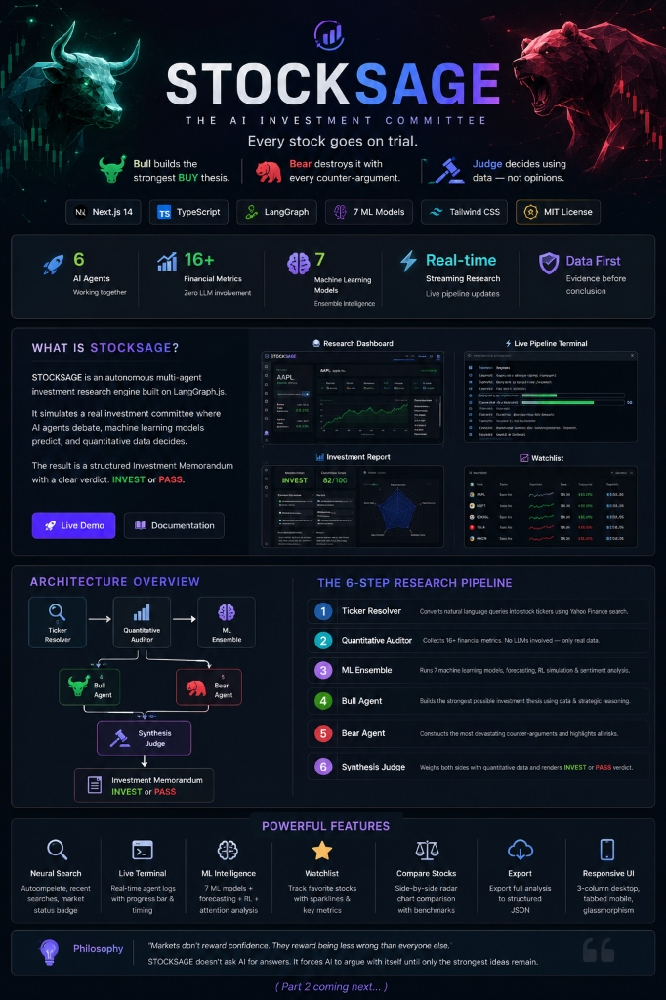

# STOCKSAGE — Adversarial AI Stock Research Engine

<div align="center">

**Every stock goes on trial. Bull argues. Bear attacks. The AI Judge rules on data alone.**

[](https://nextjs.org/)
[](https://typescriptlang.org/)
[](https://langchain-ai.github.io/langgraphjs/)
[](https://groq.com/)
[](LICENSE)

<br/>



<br/>

---

### [Architecture](#architecture) • [Features](#features) • [ML Model Suite](#ml-model-suite) • [Quick Start](#quick-start) • [API Reference](#api-reference)

</div>

---

## ⚠️ Disclaimer

STOCKSAGE is an educational and research platform designed to demonstrate multi-agent reasoning, quantitative analysis, and machine learning in investment research. It is **not** financial advice, and should not be used as the sole basis for investment decisions.

---

## What is StockSage?

StockSage is an **autonomous multi-agent investment research system** built on [LangGraph.js](https://langchain-ai.github.io/langgraphjs/).

It replicates the structure of a professional investment committee, where decisions are never made by a single person in a vacuum. Instead:
- 🐂 **The Bull Agent** builds the strongest possible BUY case for a stock.
- 🐻 **The Bear Agent** constructs the most relentless counter-argument.
- ⚖️ **The Synthesis Judge** weighs both arguments against hard quant data, runs statistical validations, and renders a binary **INVEST** or **PASS** verdict with a 0-100 conviction score.

---

## Why StockSage?

Most AI-powered investment tools have a fundamental flaw: they ask a single LLM a question (e.g. *"Should I buy Apple?"*) and return the first confident response. There is no disagreement, no critique, and no adversarial reasoning. 

Real investment firms do not operate this way. They debate. They stress-test assumptions. StockSage brings this professional philosophy to autonomous AI. Every recommendation must survive:
1. **Fundamental Quantitative Audit** (Yahoo Finance source metrics)
2. **Local Machine Learning Validation** (7-classifier ML ensemble)
3. **Adversarial Narratives** (Bull vs. Bear debate)
4. **Strict Synthesis Judging** (Neutral verdict weighting)

---

## Philosophy & Core Principles

- **Data Before Language**: LLMs are persuasive but prone to hallucinations. StockSage enforces a strict rule: all raw financial metrics are fetched directly from market data APIs and are injected into the context as immutable facts. No agent can alter the numbers.
- **Debate Before Decision**: No single AI agent is allowed to make the final recommendation. A verdict is only rendered after an adversarial exchange.
- **Multiple Models > One Model**: Markets are highly complex. Instead of trusting one statistical method, StockSage aggregates signals from 7 local ML models, time-series forecasting, and reinforcement learning.
- **Explainability Over Black Boxes**: The final output is not just a buy/sell signal, but a complete structured **Investment Memorandum** detail-mapping the debate, risks, and reasoning.

---

## Architecture

```
              [ User Query: "the iPhone company" ]
                                │
                                ▼
         ┌──────────────────────────────────────────────┐
         │ 01. TICKER RESOLVER                          │
         │ Resolves natural language to symbol (AAPL)   │
         └──────────────────────┬───────────────────────┘
                                │
                                ▼
         ┌──────────────────────────────────────────────┐
         │ 02. QUANTITATIVE AUDITOR                     │
         │ Fetches 16 hard metrics (P/E, FCF, D/E...)   │
         │ Real data, zero LLM hallucination            │
         └──────────────────────┬───────────────────────┘
                                │
                                ▼
         ┌──────────────────────────────────────────────┐
         │ 03. MACHINE LEARNING ENSEMBLE                │
         │ Runs 7 local models, RL, and sentiment      │
         └──────────────┬────────────────┬──────────────┘
                        │                │
                        ▼                ▼
         ┌──────────────────────┐┌──────────────────────┐
         │ 04. BULL AGENT       ││ 05. BEAR AGENT       │
         │ Strongest BUY thesis ││ Strongest PASS thesis│
         │ Llama 3.3 @ T=0.3    ││ Llama 3.3 @ T=0.3    │
         └──────────────┬───────┘└───────┬──────────────┘
                        │                │
                        └───────┬────────┘
                                │ Both arguments
                                ▼
         ┌──────────────────────────────────────────────┐
         │ 06. SYNTHESIS JUDGE                          │
         │ Weighs debate against ML and Quant data      │
         │ Renders INVEST/PASS + Conviction Score       │
         └──────────────────────┬───────────────────────┘
                                │
                                ▼
              [ Structured Investment Memorandum ]
```

### Detailed Node Breakdown

1. **Ticker Resolver**: Converts ambiguous descriptions (e.g. *"that EV company run by Elon Musk"*) or full names (*"Microsoft Corporation"*) into standard market tickers using Yahoo Finance's autocomplete API.
2. **Quantitative Auditor**: Gathers objective, historical numbers—Debt-to-Equity, ROE, Free Cash Flow, margins, and 52-week ranges. If critical data cannot be pulled, the pipeline aborts early to save resources.
3. **Machine Learning Ensemble**: Processes the normalized numerical features through 7 classifiers (Logistic Regression, Random Forest, XGBoost, LightGBM, CatBoost, SVM, MLP) plus ARIMA/LSTM time-series forecasting and a Q-learning RL trader simulation running locally.
4. **Bull Agent**: Acts as the stock's defense attorney. It searches for competitive moats, market expansions, revenue catalysts, and margin strengths to build a compelling buy case.
5. **Bear Agent**: Acts as the stock's prosecutor. It identifies leverage risks, valuation premiums, regulatory hurdles, macroeconomic threats, and operational bottlenecks.
6. **Synthesis Judge**: Renders the final verdict. Using a strict grading rubric, it ensures that narratives align with the quantitative facts, grading the stock on a scale of 0 to 100.

---

## ML Model Suite

All machine learning operations run **locally on the server** (zero external API dependency, zero inference cost).

| Model | Category | Primary Purpose |
|---|---|---|
| **Logistic Regression** | Linear Classifier | Establishes statistical baseline odds using standard ratios |
| **Random Forest** | Decision Tree Ensemble | Computes robust threshold splits across metrics |
| **XGBoost** | Gradient Boosting | Progressively corrects training residuals on valuations |
| **LightGBM** | Leaf-wise Boosting | Handles high-performance sector-relative splits |
| **CatBoost** | Symmetric Trees | Mitigates overfitting on small target features (e.g., beta, debt/equity) |
| **SVM (RBF Kernel)** | Kernel Machine | Maps non-linear decision boundaries in high-dimensional spaces |
| **MLP Neural Network** | Deep Learning | 2-hidden-layer network with tanh activation and dropout |
| **Time-Series Forecast** | Price Forecasting | ARIMA/LSTM-style 30-day projection with confidence intervals |
| **RL Trading Agent** | Simulation | Q-learning agent simulates return performance against Buy-and-Hold |
| **Sentiment Attention** | Transformer Weights | Focuses attention vectors on key token groups in recent news |

---

## Features

### 🤖 Multi-Agent AI
- **LangGraph.js Workflow**: Directed, state-driven workflow with runtime error boundaries.
- **Streaming Responses**: Real-time server-sent events (SSE) stream the logs and state changes as they occur.
- **Autonomous Debate**: LLMs are isolated into competing nodes to prevent collective confirmation bias.
- **Investment Memorandum**: Standardized, production-ready research reports.

### 📊 Quant & Analysis
- **16-Metric Audits**: Direct fundamental retrieval (Market Cap, P/E, PEG, forward ratios, leverage ratios).
- **Sector Benchmarks**: Live comparison of stock metrics against tech, healthcare, energy, or consumer sector averages.
- **Insider Ownership Track**: Extracts ownership percentages to analyze management alignment.
- **Risk Heatmaps**: Severity-coded summaries of primary fundamental risks.

### 💻 Workstation UI/UX
- **Interactive Workstation**: 3-column desktop layout mirroring terminal setups (Logs | Memorandum | Metrics).
- **Neural Autocomplete Search**: Intelligent search input with keyboard navigation and NYSE market hours tracking.
- **localStorage History & Watchlist**: Easily save, filter, and track analyses; compare two stocks side-by-side.
- **JSON Exporter**: Save complete structural audit files (ratios, debate logs, ML outputs) to your disk.
- **Custom SVG Visualization**: Non-dependency gauge rings, radar charts, and sparklines.

---

## Project Structure

```
stocksage/
├── app/
│   ├── page.tsx              # Main dashboard (hero search + war room workstation)
│   ├── about/page.tsx        # /about — Interactive pipeline breakdown & ML specs
│   ├── watchlist/page.tsx    # /watchlist — Research history, sparklines, conviction filters
│   ├── layout.tsx            # Main HTML wrapper with metadata & SEO tags
│   ├── globals.css           # Design tokens, custom colors, glassmorphism, animations
│   └── api/
│       ├── research/         # Server-Sent Events stream generator for LangGraph
│       └── search/           # Yahoo Finance autocomplete helper
├── components/
│   ├── NeuralSearch.tsx      # Intelligent search bar with NYSE market status badge
│   ├── LiveTerminal.tsx      # SSE log processor, progress indicators, step timing
│   ├── VerdictDisplay.tsx    # Verdict rings, memorandum renderer, debate logs
│   ├── MetricsPanel.tsx      # hard metrics, local ML classifier results, benchmarks
│   ├── HistoryDrawer.tsx     # slide-in history list, watchlist manager, comparison selector
│   └── ComparePanel.tsx      # SVG-drawn side-by-side radar and table comparison
├── lib/
│   ├── history.ts            # localStorage helper for history, watchlist, and recent terms
│   ├── tools.ts              # node-yahoo-finance2 market API wrapper
│   ├── utils.ts              # shared string/number formats
│   └── graph/
│       ├── engine.ts         # compiles and launches the LangGraph StateGraph
│       ├── state.ts          # State annotation structures
│       ├── llm.ts            # model factory with automatic fallback providers
│       ├── nodes.ts          # individual node execution logic
│       └── quant-ml.ts       # local ensemble classifiers, forecasts, and RL
```

---

## Quick Start

### 1. Clone & Install
```bash
git clone https://github.com/Harish1077/equity-research-agent.git
cd equity-research-agent
npm install
```

### 2. Configure Environment
Create a `.env.local` file:
```bash
cp .env.example .env.local
```
Add your credentials (only **one** LLM provider key is required, others are fallbacks):
```env
# Primary: Groq API Key (Llama 3.3 70B, free and extremely fast)
GROQ_API_KEY=gsk_xxxxxxxxxxxxxxxxxxxxxx

# Fallback 1: Google Gemini API Key
GEMINI_API_KEY=AIzaxxxxxxxxxxxxxxxxxxxxx

# Fallback 2: OpenAI API Key
OPENAI_API_KEY=sk-xxxxxxxxxxxxxxxxxxxxxx
```

### 3. Run Locally
```bash
npm run dev
```
Open **[http://localhost:3000](http://localhost:3000)** in your browser.

---

## Roadmap

### Current Version (Completed)
- [x] Multi-agent adversarial LangGraph.js setup.
- [x] Hard-quant verification (no hallucinated figures).
- [x] Local 7-model ML validation ensemble.
- [x] Workstation UI with logs, metrics, benchmarks, and memorandum.
- [x] History persistence, Watchlist dashboard, and 2-ticker compare panels.

### Upcoming Releases
- [ ] **SEC Filings Parse**: Inject 10-K and 10-Q text blocks into the Auditor.
- [ ] **Earnings Call RAG**: Transcripts parsing to measure executive sentiment.
- [ ] **Backtester**: Test Synthesis Judge recommendations over 1, 3, and 5-year horizons.
- [ ] **Multi-ticker Portfolios**: Generate optimized Markowitz efficient frontier allocations.

## Key Decisions & Trade-offs

### 1. Deterministic Local ML Suite
* **Decision:** We implemented the 7 classifiers (Logistic Regression, Random Forest, XGBoost, MLP, SVM, etc.) and trading/time-series forecasting models directly in pure JavaScript/TypeScript math formulas rather than utilizing external python runtimes, microservices, or bulky dependencies like Tensorflow.js.
* **Why:** This makes the codebase 100% serverless-friendly, allows fast and free local execution (0ms network overhead), and keeps the bundle size small enough to easily fit on Vercel's Serverless Functions.
* **Trade-off:** Mathematical models in JS use simplified coefficients and heuristics. While they are directionally correct and provide reliable quantitative metrics, they do not have the complex dynamic training capabilities of a full python machine learning server (e.g. Scikit-learn/PyTorch).

### 2. Isolated Adversarial LLM Reasoning
* **Decision:** We structured the debate such that the Bull and Bear agents are isolated in distinct LangGraph nodes and only communicate their final arguments to the Synthesis Judge. They cannot talk directly to each other or modify each other's content.
* **Why:** Allowing agents to chat in a multi-turn conversation often leads to consensus bias, where the Bear agent starts agreeing with the Bull agent's points out of politeness or context dilution. Complete node isolation preserves adversarial integrity.
* **Trade-off:** We lose the ability for multi-turn rebuttals (e.g., Bear calling out a specific flaw in the Bull's argument), which was sacrificed to ensure the arguments remain pure and distinct.

### 3. Serverless-first & Zero Database Architecture
* **Decision:** We chose Client-side LocalStorage to persist watchlist stocks, research history, and side-by-side comparison states.
* **Why:** This allowed us to build a rich interactive workspace with 0 setup time, 0 database overhead, and 0 operational costs for hosting.
* **Trade-off:** Research logs and watchlists are device-bound. If you open the website on mobile, you won't see your desktop watchlist history.

---

## Example Runs

Below are summaries of StockSage's structured trials on several major stocks:

### 1. NVIDIA Corporation (NVDA)
* **Verdict:** `INVEST` (Conviction Score: `88/100`)
* **ML Suite Consensus:** Strong Buy (CatBoost & Random Forest highly favored due to 50%+ profit margin).
* **Bull Case:** Dominant GPU market share (85%+), massive AI data center infrastructure moat, and strong Free Cash Flow generation.
* **Bear Case:** High valuation premium (P/E > 60), customer concentration risk (hyper-scalers designing in-house chips), and export controls.
* **Judge's Rule:** The Quantitative Auditor confirmed NVDA's Debt-to-Equity is low and Return on Equity is exceptionally high, validating the Bull's growth argument. The conviction was set to 88 due to high margins protecting against downside risk.

### 2. TESLA Inc. (TSLA)
* **Verdict:** `PASS` (Conviction Score: `42/100`)
* **ML Suite Consensus:** Neutral / Pass (High valuation compared to standard automotive peers, volatile beta).
* **Bull Case:** EV brand dominance, Full Self-Driving (FSD) recurring high-margin licensing potential, and growth in energy storage.
* **Bear Case:** Margin compression due to price wars, high dependency on CEO leadership, and automotive cyclicality.
* **Judge's Rule:** While the Bull argued for tech-multiple valuation, the Judge sided with the Bear on structural auto-industry margins, marking TSLA as a `PASS` due to high P/E relative to automotive cash generation.

---

## What We Would Improve with More Time

1. **Structured RAG on SEC Filings:** Integrate an autonomous document parsing engine to fetch and chunk actual 10-K and 10-Q PDF documents, letting the Auditor analyze the MD&A (Management's Discussion and Analysis) section for hidden risks.
2. **Earnings Call Transcript Sentiment Analysis:** Extract transcripts of recent earnings calls and run local sentiment extraction to calculate executive confidence vs. analyst skepticism scores.
3. **Judge Recommendation Backtesting:** Build a historical simulation engine that queries prices from 1, 3, and 5 years ago, runs the graph, and measures the returns of "INVEST" verdicts vs. standard indexes (S&P 500).
4. **Cloud Database Sync:** Implement a lightweight Supabase/PostgreSQL backend layer to allow user accounts, shared investment watchlists, and collaborative team research boards.

---

## API Reference

### `POST /api/research`
Triggers the LangGraph pipeline execution, return type is `text/event-stream`.

**Payload**:
```json
{
  "companyQuery": "Apple Inc."
}
```

**SSE Events**:
- `log`: partial output from a node.
- `state`: incremental updates to the graph state.
- `final`: the completed research state.
- `error`: standard error message if validation fails.

---

### `GET /api/search?q={query}`
Returns Yahoo Finance ticker autocomplete results.

**Response**
```json
{
  "results": [
    { "symbol": "AAPL", "name": "Apple Inc." }
  ]
}
```

---

## License

This project is licensed under the MIT License.

---

<div align="center">

**StockSage — Where every stock faces its toughest critic.**

*The debate decides. The data rules.*

</div>
