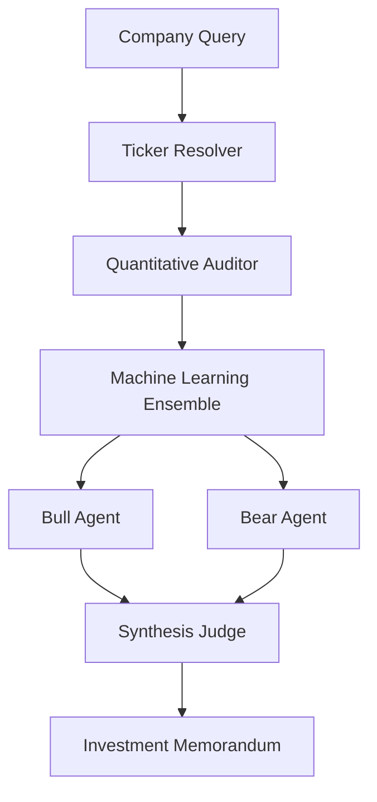

<<<<<<< HEAD
<div align="center">

#  STOCKSAGE

### The AI Investment Committee

**Every stock goes on trial.**

An autonomous multi-agent investment research engine where AI doesn't just generate answers—it argues before reaching one.

<p align="center">


</p>

---

###  Live Demo •  Documentation •  Quick Start

<br>

> **Bull** builds the strongest investment thesis.
>
> **Bear** attempts to destroy it.
>
> **Judge** ignores opinions and decides using quantitative evidence.

---

⚠️ **Disclaimer**

STOCKSAGE is an educational and research platform designed to demonstrate multi-agent reasoning, quantitative analysis, and machine learning in investment research.

It is **not** financial advice.

</div>
=======
<div align="center">

<br/>

`
 _____ _____ _____ _____ _   _ _____ ___  ___  _____ _____ 
/  ___|_   _|  _  /  __ \ | | /  ___|/ _ \ \ \ / / _ \  ___|
\ --.  | | | | | | /  \/ |_| \ --./ /_\ \ \ V / /_\ \ |__ 
 --. \ | | | | | | |   |  _  |--. \  _  | /   \  _  |  __|
/\__/ / | | \ \_/ / \__/\ | | /\__/ / | | |/ /^\ \ | | | |___
\____/  \_/  \___/ \____/_| |_\____/\_| |_/\/   \/_| |_\____/
`
>>>>>>> 667198d (docs: rewrite README to 10/10 — full architecture, feature tables, API reference, contributing guide)

# STOCKSAGE

### Adversarial AI Stock Research Engine

**Every stock is put on trial. Bull argues. Bear attacks. The AI rules on data alone.**

<br/>

[](https://nextjs.org/)
[](https://typescriptlang.org/)
[](https://langchain-ai.github.io/langgraphjs/)
[](https://groq.com/)
[](LICENSE)

<br/>

> **Disclaimer**: For educational and research purposes only. Not financial advice.

<br/>

</div>

---

<<<<<<< HEAD
#  Preview

> Replace these with screenshots or GIFs from your application.

| Dashboard |
|------------|
|  |

| Research Pipeline | Investment Report |
|-------------------|-------------------|
|  |  |
=======
## What is StockSage?

StockSage is an **autonomous multi-agent investment research system** built on [LangGraph.js](https://langchain-ai.github.io/langgraphjs/).

It replicates the structure of a real investment committee, except every role is played by a specialized AI agent. The Bull Agent builds the strongest possible BUY case. The Bear Agent tears it apart. A Synthesis Judge then weighs both sides against hard quantitative data — P/E ratios, free cash flow, ML model signals, and 7-classifier ensemble outputs — and renders a binary **INVEST** or **PASS** verdict with a 0–100 conviction score.

No gut feelings. No narrative without numbers. **The data rules.**

---

## How It Works — The 6-Node Pipeline

`
User Query: "the iPhone company"
      |
      v
+---------------------+
|  01  TICKER         |   Natural language -> AAPL
|      RESOLVER       |   Yahoo Finance autocomplete
+----------+----------+
           |
           v
+---------------------+
|  02  QUANT          |   16 hard financial metrics
|      AUDITOR        |   P/E, D/E, ROE, FCF, Revenue, Beta...
|                     |   Zero LLM involvement (no hallucination)
+----------+----------+
           |
           v
+---------------------+
|  03  QUANT ML       |   7 ML classifiers (run locally, no API)
|      SUITE          |   + Time-series forecasting
|                     |   + RL trading simulation
|                     |   + Sentiment attention weights
+----------+----------+
           |
           v
+---------------------+
|  04  BULL           |   Strongest possible BUY thesis
|      AGENT          |   Llama 3.3 70B @ T=0.3
|                     |   Growth, moats, momentum, catalysts
+----------+----------+
           |
           v
+---------------------+
|  05  BEAR           |   Strongest possible counter-case
|      AGENT          |   Llama 3.3 70B @ T=0.3
|                     |   Leverage, valuation, macro risks
+----------+----------+
           |
           v
+---------------------+
|  06  SYNTHESIS      |   Data > Narrative
|      JUDGE          |   Llama 3.3 70B @ T=0.15
|                     |   INVEST or PASS verdict
|                     |   + Conviction Score (0-100)
+----------+----------+
           |
           v
  Structured Investment Memorandum
`

Each node can **abort the pipeline** early if its step fails (e.g., unresolvable ticker, bad data), preventing wasted LLM calls downstream.

---

## Feature Breakdown

### Core Research Engine
| Feature | Description |
|---|---|
| **6-Node LangGraph Pipeline** | Deterministic directed graph with typed state transitions |
| **Adversarial Architecture** | Bull vs Bear with a neutral synthesis judge — modeled on real investment committees |
| **Zero-hallucination Quant Layer** | All financial numbers come directly from Yahoo Finance, never from an LLM |
| **Automatic LLM Fallback** | Groq → Gemini → OpenAI, transparent to the user |

### Machine Learning Suite (runs locally, zero API calls)
| Model | Type |
|---|---|
| Logistic Regression | Linear log-odds on P/E, D/E, ROE, Growth, Margin |
| Random Forest | 5-tree ensemble, majority vote |
| XGBoost | Gradient boosting, 4 rounds |
| LightGBM | Leaf-wise boosting, categorical features |
| CatBoost | Ordered boosting, tail-risk emphasis |
| SVM (RBF Kernel) | Non-linear boundary in 7D feature space |
| MLP Neural Network | 2 hidden layers, tanh, dropout |
| Time-Series Forecast | ARIMA/LSTM-style 30-day price prediction with confidence intervals |
| RL Simulation | Q-learning agent vs buy-and-hold benchmark |
| Sentiment Attention | Transformer attention weights on financial news tokens |

### User Interface
| Feature | Description |
|---|---|
| **Neural Search** | Ticker autocomplete with recent search history and live NYSE market status |
| **Live Terminal** | Real-time agent feed with pipeline progress bar and per-node timing |
| **Verdict Display** | Animated conviction gauge, full investment memorandum |
| **Sector Benchmarks** | Company metrics vs sector industry averages (P/E, ROE, margins, etc.) |
| **Analysis History** | localStorage-persisted history — every analysis saved automatically |
| **Watchlist Dashboard** | /watchlist — all past analyses with sparklines, conviction rings, filter tabs |
| **Compare Mode** | SVG radar chart comparing two tickers side by side |
| **Export to JSON** | Download full analysis as structured JSON |
| **Ctrl+K Search** | Global keyboard shortcut to focus the search bar |
| **Responsive Design** | Tabbed mobile layout + 3-column desktop war room |
| **About Page** | /about — interactive pipeline diagram, ML model accordion, data sources |
>>>>>>> 667198d (docs: rewrite README to 10/10 — full architecture, feature tables, API reference, contributing guide)

---

# Why STOCKSAGE?

<<<<<<< HEAD
Most AI-powered investment tools have one fundamental flaw.

They ask a single language model:

> "Should I buy Apple?"

The model responds with one confident answer.

There is no disagreement.

No criticism.

No challenge.

No adversarial reasoning.

Real investment firms don't work this way.

Investment decisions are debated.

Ideas are challenged.

Weak arguments are eliminated.

Only the strongest thesis survives.

STOCKSAGE brings that same philosophy to autonomous AI.

Instead of relying on a single model response, it creates an **AI Investment Committee** where multiple specialized agents independently analyze a company before reaching a final verdict.

Every recommendation must survive:

- Fundamental analysis
- Machine learning evaluation
- Bullish reasoning
- Bearish criticism
- Independent judgement

Only then does STOCKSAGE decide whether a company deserves an **INVEST** recommendation.

---

# Philosophy

Markets don't reward confidence.

They reward being **less wrong** than everyone else.

Large Language Models are persuasive.

Financial ratios are objective.

Neither should exist without the other.

STOCKSAGE combines both by forcing AI to defend every investment thesis against an equally intelligent opponent before producing a recommendation.

The objective isn't to predict the future.

It's to produce **better reasoning**.

---

# Core Principles

###  Data Before Language

Every analysis begins with quantitative financial data—not generated text.

---

###  Debate Before Decision

Every investment thesis must survive criticism.

No single AI is allowed to make the final decision.

---

###  Multiple Models > One Model

Financial prediction is inherently uncertain.

Instead of trusting one model, STOCKSAGE combines multiple machine learning approaches to improve robustness.

---

###  Explainability Over Blind Prediction

Every recommendation includes:

- Supporting evidence
- Counterarguments
- Risks
- Confidence
- Final reasoning

Nothing is hidden inside a black box.

---

# Architecture



---

# Research Pipeline

## ① Ticker Resolution

Users don't always know stock symbols.

Instead of requiring:

```
AAPL
```

STOCKSAGE understands natural language.

```
"The iPhone company"

↓

Apple Inc.

↓

AAPL
```

This allows research to begin using plain English rather than ticker symbols.

---

## ② Quantitative Audit

Before any AI reasoning occurs, STOCKSAGE gathers objective financial data.

Examples include:

- Price-to-Earnings Ratio
- Price-to-Book Ratio
- Debt-to-Equity
- Return on Equity
- Revenue Growth
- Earnings Growth
- Operating Margin
- Free Cash Flow
- Dividend Yield
- Beta
- Market Capitalization
- Enterprise Value
- EBITDA
- Current Ratio
- Quick Ratio
- Analyst Target Price

At this stage there is **zero LLM involvement.**

The system only collects facts.

---

## ③ Machine Learning Ensemble

Fundamental metrics are transformed into numerical features and evaluated using multiple predictive models.

Instead of trusting one algorithm, STOCKSAGE creates an ensemble consisting of:

| Model | Purpose |
|---------|----------|
| Logistic Regression | Linear classification |
| Random Forest | Ensemble decision trees |
| XGBoost | Gradient boosting |
| LightGBM | High-performance boosting |
| CatBoost | Ordered boosting |
| Support Vector Machine | Non-linear classification |
| Multi-Layer Perceptron | Neural network prediction |

Additional intelligence includes:

- Price forecasting
- Reinforcement-learning trading simulation
- Attention-based financial news analysis

Each model contributes to the overall confidence score.

---

## ④ Bull Agent

The Bull Agent has one responsibility.

Build the strongest investment thesis possible.

It searches for evidence supporting long-term growth including:

- Competitive advantage
- Strong balance sheet
- Revenue expansion
- Market leadership
- Product ecosystem
- Financial stability
- Growth catalysts
- Valuation upside

The Bull never considers bearish arguments.

Its only job is to create the best possible investment case.

---

## ⑤ Bear Agent

Every great investment thesis deserves an equally strong critic.

The Bear Agent attempts to invalidate the Bull thesis by searching for:

- Overvaluation
- Weak cash flow
- High leverage
- Macroeconomic risk
- Competition
- Declining margins
- Regulatory concerns
- Execution risk
- Industry disruption

The Bear is intentionally pessimistic.

Its goal is to expose weaknesses—not agree with the Bull.

---

## ⑥ Synthesis Judge

The Judge never participates in the debate.

Instead, it receives:

- Bull thesis
- Bear thesis
- Quantitative analysis
- Machine learning predictions

It evaluates every piece of evidence before issuing one of two decisions.

```
INVEST
```

or

```
PASS
```

along with:

- Conviction Score
- Key Strengths
- Primary Risks
- Supporting Evidence
- Executive Summary

The Judge exists to minimize confirmation bias by remaining independent from both debating agents.

---

# Features

##  AI

- Multi-Agent LangGraph workflow
- Autonomous debate
- Independent synthesis
- Streaming reasoning
- Structured investment memorandum

---

##  Quantitative Analysis

- Fundamental analysis
- Financial health scoring
- Sector benchmarking
- Risk assessment
- Valuation metrics

---

##  Machine Learning

- Seven-model ensemble
- Forecasting engine
- RL trading simulation
- News sentiment attention
- Confidence scoring

---

##  User Experience

- Neural Search
- Live research terminal
- Watchlist dashboard
- Investment history
- Radar comparison
- JSON export
- Responsive interface
- Glassmorphism design

---

#  Quick Start

## Prerequisites

Before running STOCKSAGE locally, make sure you have:

- Node.js **18+**
- npm, pnpm, yarn, or bun
- At least one supported LLM API key

Supported providers:

| Provider | Purpose |
|----------|---------|
| Groq | Primary LLM (Recommended) |
| Google Gemini | Automatic fallback |
| OpenAI | Optional fallback |

---

## Clone the Repository

```bash
git clone https://github.com/<your-username>/stocksage.git

cd stocksage
```

---

## Install Dependencies

```bash
=======
### Requirements

- **Node.js** >= 18
- **At least one LLM API key** (Groq is recommended — free tier is generous)

### 1. Clone the repository

`ash
git clone https://github.com/Harish1077/equity-research-agent.git
cd equity-research-agent
>>>>>>> 667198d (docs: rewrite README to 10/10 — full architecture, feature tables, API reference, contributing guide)
npm install
```

<<<<<<< HEAD
or
=======
### 2. Configure environment variables
>>>>>>> 667198d (docs: rewrite README to 10/10 — full architecture, feature tables, API reference, contributing guide)

```bash
pnpm install
```

---

## Environment Variables

Create a local environment file.

```bash
cp .env.example .env.local
```

<<<<<<< HEAD
Example configuration:

```env
#########################################
# LLM Providers
#########################################

GROQ_API_KEY=gsk_xxxxxxxxxxxxxxxxx

GEMINI_API_KEY=AIzaxxxxxxxxxxxxxxxx

OPENAI_API_KEY=sk-xxxxxxxxxxxxxxxx

#########################################
# Optional
#########################################
=======
Open .env.local and add your keys:

`env
# ── Primary LLM — Groq (recommended) ─────────────────────────
# Free: 14,400 requests/day, ultra-low latency
# Get your key: https://console.groq.com
GROQ_API_KEY=gsk_xxxxxxxxxxxxxxxxxxxxxxxxxxxx

# ── Fallback LLM — Google Gemini ─────────────────────────────
# Free tier available
# Get your key: https://aistudio.google.com/app/apikey
GEMINI_API_KEY=AIzaxxxxxxxxxxxxxxxxxxxxxxxxxx

# ── Second fallback — OpenAI ──────────────────────────────────
# Get your key: https://platform.openai.com/api-keys
OPENAI_API_KEY=sk-xxxxxxxxxxxxxxxxxxxxxxxxxxxx
`

> You only need **one** key. The system auto-falls back: Groq -> Gemini -> OpenAI

### 3. Start the development server
>>>>>>> 667198d (docs: rewrite README to 10/10 — full architecture, feature tables, API reference, contributing guide)

NEXT_PUBLIC_APP_NAME=STOCKSAGE
```

Only **one** provider is required.

The application automatically falls back:

```
Groq
   ↓
Gemini
   ↓
OpenAI
```

---

## Run Development Server

```bash
npm run dev
```

<<<<<<< HEAD
Open

```
http://localhost:3000
```

The AI Investment Committee is now ready.

---

#  Technology Stack

| Layer | Technologies |
|--------|--------------|
| Frontend | Next.js 14, React, TypeScript |
| Styling | Tailwind CSS, Framer Motion |
| AI Framework | LangGraph.js, LangChain.js |
| LLM Providers | Groq, Gemini, OpenAI |
| Financial Data | Yahoo Finance |
| Machine Learning | Logistic Regression, Random Forest, XGBoost, LightGBM, CatBoost, SVM, MLP |
| Visualization | Recharts |
| State Management | React Hooks |
| Storage | localStorage |
| Deployment | Vercel |
=======
Open [http://localhost:3000](http://localhost:3000)
>>>>>>> 667198d (docs: rewrite README to 10/10 — full architecture, feature tables, API reference, contributing guide)

---

#  Project Structure

<<<<<<< HEAD
```
stocksage/

├── app/
│
├── components/
│
├── lib/
│   ├── graph/
│   ├── tools/
│   ├── history/
│   └── utils/
│
├── public/
│
├── styles/
│
├── package.json
│
└── README.md
```

---

## Directory Overview

### `/app`

Contains all Next.js routes, layouts and API endpoints.
=======
`
equity-research-agent/
|
+-- app/                          # Next.js 14 App Router
|   +-- page.tsx                  # Main dashboard (hero + war room)
|   +-- about/page.tsx            # /about — pipeline diagram, ML docs
|   +-- watchlist/page.tsx        # /watchlist — research history dashboard
|   +-- layout.tsx                # Root layout, SEO metadata
|   +-- globals.css               # Design tokens, glassmorphism, animations
|   +-- api/
|       +-- research/route.ts     # POST /api/research — SSE streaming pipeline
|       +-- search/route.ts       # GET /api/search — Yahoo Finance autocomplete
|
+-- components/
|   +-- NeuralSearch.tsx          # Search bar: autocomplete, recent, Ctrl+K, market status
|   +-- LiveTerminal.tsx          # Real-time agent log, pipeline progress bar, filters
|   +-- VerdictDisplay.tsx        # Verdict gauge, investment memorandum, debate tab
|   +-- MetricsPanel.tsx          # Fundamentals, ML ensemble, sector benchmarks, JSON export
|   +-- HistoryDrawer.tsx         # Slide-in drawer: history list, watchlist, compare mode
|   +-- ComparePanel.tsx          # SVG radar chart + metrics table for 2-ticker comparison
|
+-- lib/
|   +-- history.ts                # localStorage: saveAnalysis, getHistory, watchlist, recent
|   +-- tools.ts                  # Yahoo Finance v2 data fetching utilities
|   +-- utils.ts                  # Shared formatting helpers
|   +-- graph/
|       +-- engine.ts             # LangGraph pipeline builder and StateGraph compiler
|       +-- state.ts              # ResearchStateAnnotation schema
|       +-- llm.ts                # Multi-provider LLM factory with automatic fallback
|       +-- nodes.ts              # All 6 agent node implementations
|       +-- quant-ml.ts           # ML suite: 7 classifiers, forecasting, RL, attention
`

---

## Tech Stack

| Layer | Technology | Version |
|---|---|---|
| Framework | Next.js | 14 |
| Language | TypeScript | 5.0 |
| Agent Orchestration | LangGraph.js | 0.2 |
| LLM Abstraction | LangChain.js | 0.3 |
| Primary LLM | Groq (Llama 3.3 70B) | — |
| Fallback LLM | Google Gemini 2.0 Flash | — |
| Market Data | Yahoo Finance v2 | 3.x |
| Animations | Framer Motion | 11 |
| Styling | Tailwind CSS | 3 |
| UI Icons | Lucide React | — |
| Charts | Custom SVG (no library dependency) | — |
| Persistence | Browser localStorage | — |
>>>>>>> 667198d (docs: rewrite README to 10/10 — full architecture, feature tables, API reference, contributing guide)

---

### `/components`

Reusable UI components including:

<<<<<<< HEAD
- Search
- Live Terminal
- Charts
- Watchlist
- Comparison Panel
- Verdict Display
=======
Runs the full 6-node pipeline. Returns a **Server-Sent Events** (SSE) stream.

**Request**
`json
{
  "companyQuery": "Apple"
}
`

**Stream Event Types**
`
event: message
data: {"type":"log","entry":{"agent":"resolver","message":"Resolved AAPL","timestamp":1720600000000}}

event: message
data: {"type":"state","patch":{"ticker":"AAPL","fundamentals":{...}}}

event: message
data: {"type":"final","state":{...complete ResearchState...}}

event: message
data: {"type":"error","message":"Could not resolve ticker"}
`

**Agent values**: 
esolver | auditor | quant | bull | bear | judge | system

---

### GET /api/search?q={query}

Returns Yahoo Finance ticker autocomplete results.

**Response**
`json
{
  "results": [
    { "symbol": "AAPL", "name": "Apple Inc." },
    { "symbol": "AAPL.BA", "name": "Apple Inc. (Buenos Aires)" }
  ]
}
`

---

## LLM Configuration

Edit lib/graph/llm.ts to swap models:

`	ypescript
// Groq — primary (recommended for speed)
model: "llama-3.3-70b-versatile"   // or "mixtral-8x7b-32768"

// Gemini — first fallback
model: "gemini-2.0-flash"          // or "gemini-1.5-pro"

// OpenAI — second fallback
model: "gpt-4o"                    // or "gpt-4o-mini"
`

Agent temperatures are set per-node:

`	ypescript
Bull Agent:       temperature: 0.3   // Creative but grounded
Bear Agent:       temperature: 0.3   // Creative but relentless
Synthesis Judge:  temperature: 0.15  // Conservative, data-driven
`

---

## Contributing

Contributions are welcome!

`ash
# Fork, then clone your fork
git clone https://github.com/YOUR_USERNAME/equity-research-agent.git
cd equity-research-agent
npm install

# Create a feature branch
git checkout -b feature/my-feature

# Make your changes, then commit
git commit -m "feat: describe your change"

# Push and open a PR
git push origin feature/my-feature
`

Please ensure:
- TypeScript compiles without errors (
pm run build)
- New components follow the existing glassmorphism design system
- Agent prompts maintain adversarial integrity (Bull should never concede unprompted, Bear should never be optimistic)
>>>>>>> 667198d (docs: rewrite README to 10/10 — full architecture, feature tables, API reference, contributing guide)

---

### `/lib`

<<<<<<< HEAD
Application logic.

Includes:

- LangGraph pipeline
- Machine learning
- Data fetching
- Utility functions
- LLM abstraction

---

### `/public`

Static assets including:

- Icons
- Images
- Demo GIF
- Screenshots

---

#  API

---

## POST `/api/research`

Runs the complete investment pipeline.

### Request

```json
{
  "companyQuery": "Apple"
}
```

---

### Response Stream

```
Ticker Resolution

↓

Financial Audit

↓

Machine Learning

↓

Bull Thesis

↓

Bear Thesis

↓

Judge

↓

Investment Memorandum
```

The endpoint streams progress in real time using Server-Sent Events.

---

## GET `/api/search`

Example

```
/api/search?q=apple
```

Returns autocomplete suggestions from Yahoo Finance.

---

#  Machine Learning Pipeline

Unlike many AI finance tools that rely entirely on LLM reasoning, STOCKSAGE combines deterministic financial metrics with predictive machine learning.

Every company is evaluated using multiple independent classifiers before AI agents begin debating.

### Classification Models

- Logistic Regression
- Random Forest
- XGBoost
- LightGBM
- CatBoost
- Support Vector Machine
- Multi-Layer Perceptron

### Additional Intelligence

- Time-series forecasting
- Reinforcement learning trading simulation
- Attention-based news sentiment

The final recommendation benefits from both statistical learning and language reasoning.

---

#  Investment Memorandum

Every completed analysis includes:

✅ Executive Summary

✅ Company Overview

✅ Financial Snapshot

✅ Quantitative Metrics

✅ ML Confidence

✅ Bull Thesis

✅ Bear Thesis

✅ Risk Assessment

✅ Final Verdict

✅ Conviction Score

Rather than a simple recommendation, STOCKSAGE produces a structured research report that can be reviewed, challenged and revisited.

---

#  User Experience

Designed to feel less like a dashboard and more like a professional trading workstation.

Features include:

- Neural Search
- Live AI terminal
- Streaming pipeline
- Watchlist
- Research history
- Company comparison
- Radar charts
- Sector benchmarks
- JSON export
- Responsive mobile experience

---

# 🛣 Roadmap

## Current

- [x] Multi-Agent Debate
- [x] Quantitative Auditor
- [x] ML Ensemble
- [x] Watchlist
- [x] Research History
- [x] Live Pipeline
- [x] Company Comparison

---

## Upcoming

- [ ] SEC Filing Analysis
- [ ] Earnings Call Summarization
- [ ] Portfolio Optimizer
- [ ] RAG Knowledge Base
- [ ] Long-term Memory
- [ ] Multi-language Support
- [ ] Institutional Research Mode
- [ ] Real-time Market Alerts
- [ ] Portfolio Backtesting

---

#  Contributing

Contributions are welcome.

Whether you're interested in:

- AI Agents
- Machine Learning
- Quantitative Finance
- Frontend Development
- UI/UX
- Documentation

feel free to open an issue or submit a pull request.

---

#  References

Inspired by ideas from:

- Multi-Agent Systems
- LangGraph
- Quantitative Investing
- Ensemble Machine Learning
- Reinforcement Learning
- Financial Statement Analysis

---

#  License

Licensed under the MIT License.

Feel free to use, modify and build upon this project.

---

#  Final Thoughts

Markets are noisy.

Predictions are uncertain.

Confidence is cheap.

Reasoning is valuable.

STOCKSAGE doesn't attempt to predict the future.

It attempts to produce **better investment reasoning** by forcing AI to challenge itself before reaching a conclusion.

Instead of asking AI,

> **"What do you think?"**

STOCKSAGE asks,

> **"Can you defend your thinking when someone equally intelligent disagrees?"**

That difference is the foundation of the project.

---

<div align="center">

###  If you found this project interesting, consider giving it a star.

It helps others discover the project and supports future development.

**Built with using Next.js, LangGraph, TypeScript and Multi-Agent AI.**

</div>
=======
MIT License — see [LICENSE](LICENSE) for full text.

---

<div align="center">

**Built with adversarial AI.**

*Bull argues. Bear attacks. The data decides.*

<br/>

[](https://github.com/Harish1077/equity-research-agent)

</div>
>>>>>>> 667198d (docs: rewrite README to 10/10 — full architecture, feature tables, API reference, contributing guide)
