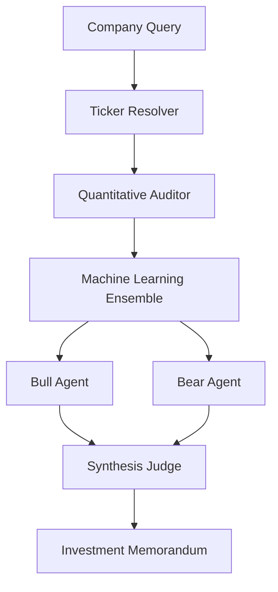

<div align="center">

#  STOCKSAGE

### The AI Investment Committee

**Every stock goes on trial.**

An autonomous multi-agent investment research engine where AI doesn't just generate answers—it argues before reaching one.

<p align="center">


</p>

---

###  Live Demo •  Documentation •  Quick Start

<br>

> **Bull** builds the strongest investment thesis.
>
> **Bear** attempts to destroy it.
>
> **Judge** ignores opinions and decides using quantitative evidence.

---

⚠️ **Disclaimer**

STOCKSAGE is an educational and research platform designed to demonstrate multi-agent reasoning, quantitative analysis, and machine learning in investment research.

It is **not** financial advice.

</div>

---

#  Preview

> Replace these with screenshots or GIFs from your application.

| Dashboard |
|------------|
|  |

| Research Pipeline | Investment Report |
|-------------------|-------------------|
|  |  |

---

# Why STOCKSAGE?

Most AI-powered investment tools have one fundamental flaw.

They ask a single language model:

> "Should I buy Apple?"

The model responds with one confident answer.

There is no disagreement.

No criticism.

No challenge.

No adversarial reasoning.

Real investment firms don't work this way.

Investment decisions are debated.

Ideas are challenged.

Weak arguments are eliminated.

Only the strongest thesis survives.

STOCKSAGE brings that same philosophy to autonomous AI.

Instead of relying on a single model response, it creates an **AI Investment Committee** where multiple specialized agents independently analyze a company before reaching a final verdict.

Every recommendation must survive:

- Fundamental analysis
- Machine learning evaluation
- Bullish reasoning
- Bearish criticism
- Independent judgement

Only then does STOCKSAGE decide whether a company deserves an **INVEST** recommendation.

---

# Philosophy

Markets don't reward confidence.

They reward being **less wrong** than everyone else.

Large Language Models are persuasive.

Financial ratios are objective.

Neither should exist without the other.

STOCKSAGE combines both by forcing AI to defend every investment thesis against an equally intelligent opponent before producing a recommendation.

The objective isn't to predict the future.

It's to produce **better reasoning**.

---

# Core Principles

###  Data Before Language

Every analysis begins with quantitative financial data—not generated text.

---

###  Debate Before Decision

Every investment thesis must survive criticism.

No single AI is allowed to make the final decision.

---

###  Multiple Models > One Model

Financial prediction is inherently uncertain.

Instead of trusting one model, STOCKSAGE combines multiple machine learning approaches to improve robustness.

---

###  Explainability Over Blind Prediction

Every recommendation includes:

- Supporting evidence
- Counterarguments
- Risks
- Confidence
- Final reasoning

Nothing is hidden inside a black box.

---

# Architecture



---

# Research Pipeline

## ① Ticker Resolution

Users don't always know stock symbols.

Instead of requiring:

```
AAPL
```

STOCKSAGE understands natural language.

```
"The iPhone company"

↓

Apple Inc.

↓

AAPL
```

This allows research to begin using plain English rather than ticker symbols.

---

## ② Quantitative Audit

Before any AI reasoning occurs, STOCKSAGE gathers objective financial data.

Examples include:

- Price-to-Earnings Ratio
- Price-to-Book Ratio
- Debt-to-Equity
- Return on Equity
- Revenue Growth
- Earnings Growth
- Operating Margin
- Free Cash Flow
- Dividend Yield
- Beta
- Market Capitalization
- Enterprise Value
- EBITDA
- Current Ratio
- Quick Ratio
- Analyst Target Price

At this stage there is **zero LLM involvement.**

The system only collects facts.

---

## ③ Machine Learning Ensemble

Fundamental metrics are transformed into numerical features and evaluated using multiple predictive models.

Instead of trusting one algorithm, STOCKSAGE creates an ensemble consisting of:

| Model | Purpose |
|---------|----------|
| Logistic Regression | Linear classification |
| Random Forest | Ensemble decision trees |
| XGBoost | Gradient boosting |
| LightGBM | High-performance boosting |
| CatBoost | Ordered boosting |
| Support Vector Machine | Non-linear classification |
| Multi-Layer Perceptron | Neural network prediction |

Additional intelligence includes:

- Price forecasting
- Reinforcement-learning trading simulation
- Attention-based financial news analysis

Each model contributes to the overall confidence score.

---

## ④ Bull Agent

The Bull Agent has one responsibility.

Build the strongest investment thesis possible.

It searches for evidence supporting long-term growth including:

- Competitive advantage
- Strong balance sheet
- Revenue expansion
- Market leadership
- Product ecosystem
- Financial stability
- Growth catalysts
- Valuation upside

The Bull never considers bearish arguments.

Its only job is to create the best possible investment case.

---

## ⑤ Bear Agent

Every great investment thesis deserves an equally strong critic.

The Bear Agent attempts to invalidate the Bull thesis by searching for:

- Overvaluation
- Weak cash flow
- High leverage
- Macroeconomic risk
- Competition
- Declining margins
- Regulatory concerns
- Execution risk
- Industry disruption

The Bear is intentionally pessimistic.

Its goal is to expose weaknesses—not agree with the Bull.

---

## ⑥ Synthesis Judge

The Judge never participates in the debate.

Instead, it receives:

- Bull thesis
- Bear thesis
- Quantitative analysis
- Machine learning predictions

It evaluates every piece of evidence before issuing one of two decisions.

```
INVEST
```

or

```
PASS
```

along with:

- Conviction Score
- Key Strengths
- Primary Risks
- Supporting Evidence
- Executive Summary

The Judge exists to minimize confirmation bias by remaining independent from both debating agents.

---

# Features

##  AI

- Multi-Agent LangGraph workflow
- Autonomous debate
- Independent synthesis
- Streaming reasoning
- Structured investment memorandum

---

##  Quantitative Analysis

- Fundamental analysis
- Financial health scoring
- Sector benchmarking
- Risk assessment
- Valuation metrics

---

##  Machine Learning

- Seven-model ensemble
- Forecasting engine
- RL trading simulation
- News sentiment attention
- Confidence scoring

---

##  User Experience

- Neural Search
- Live research terminal
- Watchlist dashboard
- Investment history
- Radar comparison
- JSON export
- Responsive interface
- Glassmorphism design

---

#  Quick Start

## Prerequisites

Before running STOCKSAGE locally, make sure you have:

- Node.js **18+**
- npm, pnpm, yarn, or bun
- At least one supported LLM API key

Supported providers:

| Provider | Purpose |
|----------|---------|
| Groq | Primary LLM (Recommended) |
| Google Gemini | Automatic fallback |
| OpenAI | Optional fallback |

---

## Clone the Repository

```bash
git clone https://github.com/<your-username>/stocksage.git

cd stocksage
```

---

## Install Dependencies

```bash
npm install
```

or

```bash
pnpm install
```

---

## Environment Variables

Create a local environment file.

```bash
cp .env.example .env.local
```

Example configuration:

```env
#########################################
# LLM Providers
#########################################

GROQ_API_KEY=gsk_xxxxxxxxxxxxxxxxx

GEMINI_API_KEY=AIzaxxxxxxxxxxxxxxxx

OPENAI_API_KEY=sk-xxxxxxxxxxxxxxxx

#########################################
# Optional
#########################################

NEXT_PUBLIC_APP_NAME=STOCKSAGE
```

Only **one** provider is required.

The application automatically falls back:

```
Groq
   ↓
Gemini
   ↓
OpenAI
```

---

## Run Development Server

```bash
npm run dev
```

Open

```
http://localhost:3000
```

The AI Investment Committee is now ready.

---

#  Technology Stack

| Layer | Technologies |
|--------|--------------|
| Frontend | Next.js 14, React, TypeScript |
| Styling | Tailwind CSS, Framer Motion |
| AI Framework | LangGraph.js, LangChain.js |
| LLM Providers | Groq, Gemini, OpenAI |
| Financial Data | Yahoo Finance |
| Machine Learning | Logistic Regression, Random Forest, XGBoost, LightGBM, CatBoost, SVM, MLP |
| Visualization | Recharts |
| State Management | React Hooks |
| Storage | localStorage |
| Deployment | Vercel |

---

#  Project Structure

```
stocksage/

├── app/
│
├── components/
│
├── lib/
│   ├── graph/
│   ├── tools/
│   ├── history/
│   └── utils/
│
├── public/
│
├── styles/
│
├── package.json
│
└── README.md
```

---

## Directory Overview

### `/app`

Contains all Next.js routes, layouts and API endpoints.

---

### `/components`

Reusable UI components including:

- Search
- Live Terminal
- Charts
- Watchlist
- Comparison Panel
- Verdict Display

---

### `/lib`

Application logic.

Includes:

- LangGraph pipeline
- Machine learning
- Data fetching
- Utility functions
- LLM abstraction

---

### `/public`

Static assets including:

- Icons
- Images
- Demo GIF
- Screenshots

---

#  API

---

## POST `/api/research`

Runs the complete investment pipeline.

### Request

```json
{
  "companyQuery": "Apple"
}
```

---

### Response Stream

```
Ticker Resolution

↓

Financial Audit

↓

Machine Learning

↓

Bull Thesis

↓

Bear Thesis

↓

Judge

↓

Investment Memorandum
```

The endpoint streams progress in real time using Server-Sent Events.

---

## GET `/api/search`

Example

```
/api/search?q=apple
```

Returns autocomplete suggestions from Yahoo Finance.

---

#  Machine Learning Pipeline

Unlike many AI finance tools that rely entirely on LLM reasoning, STOCKSAGE combines deterministic financial metrics with predictive machine learning.

Every company is evaluated using multiple independent classifiers before AI agents begin debating.

### Classification Models

- Logistic Regression
- Random Forest
- XGBoost
- LightGBM
- CatBoost
- Support Vector Machine
- Multi-Layer Perceptron

### Additional Intelligence

- Time-series forecasting
- Reinforcement learning trading simulation
- Attention-based news sentiment

The final recommendation benefits from both statistical learning and language reasoning.

---

#  Investment Memorandum

Every completed analysis includes:

✅ Executive Summary

✅ Company Overview

✅ Financial Snapshot

✅ Quantitative Metrics

✅ ML Confidence

✅ Bull Thesis

✅ Bear Thesis

✅ Risk Assessment

✅ Final Verdict

✅ Conviction Score

Rather than a simple recommendation, STOCKSAGE produces a structured research report that can be reviewed, challenged and revisited.

---

#  User Experience

Designed to feel less like a dashboard and more like a professional trading workstation.

Features include:

- Neural Search
- Live AI terminal
- Streaming pipeline
- Watchlist
- Research history
- Company comparison
- Radar charts
- Sector benchmarks
- JSON export
- Responsive mobile experience

---

# 🛣 Roadmap

## Current

- [x] Multi-Agent Debate
- [x] Quantitative Auditor
- [x] ML Ensemble
- [x] Watchlist
- [x] Research History
- [x] Live Pipeline
- [x] Company Comparison

---

## Upcoming

- [ ] SEC Filing Analysis
- [ ] Earnings Call Summarization
- [ ] Portfolio Optimizer
- [ ] RAG Knowledge Base
- [ ] Long-term Memory
- [ ] Multi-language Support
- [ ] Institutional Research Mode
- [ ] Real-time Market Alerts
- [ ] Portfolio Backtesting

---

#  Contributing

Contributions are welcome.

Whether you're interested in:

- AI Agents
- Machine Learning
- Quantitative Finance
- Frontend Development
- UI/UX
- Documentation

feel free to open an issue or submit a pull request.

---

#  References

Inspired by ideas from:

- Multi-Agent Systems
- LangGraph
- Quantitative Investing
- Ensemble Machine Learning
- Reinforcement Learning
- Financial Statement Analysis

---

#  License

Licensed under the MIT License.

Feel free to use, modify and build upon this project.

---

#  Final Thoughts

Markets are noisy.

Predictions are uncertain.

Confidence is cheap.

Reasoning is valuable.

STOCKSAGE doesn't attempt to predict the future.

It attempts to produce **better investment reasoning** by forcing AI to challenge itself before reaching a conclusion.

Instead of asking AI,

> **"What do you think?"**

STOCKSAGE asks,

> **"Can you defend your thinking when someone equally intelligent disagrees?"**

That difference is the foundation of the project.

---

<div align="center">

###  If you found this project interesting, consider giving it a star.

It helps others discover the project and supports future development.

**Built with using Next.js, LangGraph, TypeScript and Multi-Agent AI.**

</div>
